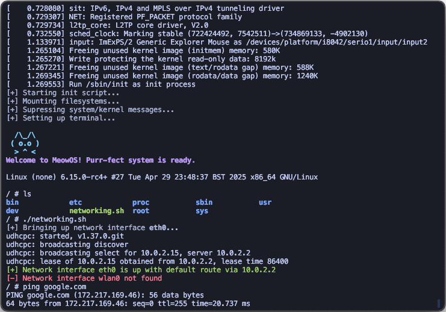

# MeowOS

A minimal, custom linux-based "operating system", with custom shell, init, busybox, v6.1 kernel, etc.



## Project Structure

- `/` - Main project directory
  - `/shell` - Custom shell implementation
  - `/init` - Custom init.sh + init.c wrapper implementation
  - `/initramfs` - Generated directory for initial ramdisk
  - `Makefile` - Main build system
  - `kernel.config.tiny` - Smaller linux kernel configuration
  - `kernel.config.def` - Default/heavier linux kernel configuration
  - `busybox.config` - BusyBox configuration
  - `initramfs-shallow` - Hard files to copy into initramfs

## Building

### Prerequisites

- GCC and development tools
- Linux kernel source code in `../linux` (relative to the meowos directory)
- Internet connection (for downloading BusyBox)
- QEMU for testing

### Build Commands

```bash
# Build everything for x86_64 -> bzImage,cpio + iso (shell, init, busybox, initramfs, kernel)
make all

# Build just the shell
make {shell,init}

# Menuconfig for kernel, busybox
make {menuconfig_kernel,menuconfig_busybox}

# Clean build artifacts
make clean

# Clean everything including downloaded components
make distclean

# Run the OS in QEMU
make run
```

## Linux Kernel - Git Submodule

```bash
# From the meowos parent directory
git submodule add --depth=1 https://github.com/torvalds/linux.git linux
git submodule update --init --depth=1 linux
cd linux
git checkout v6.1  # or your desired stable version
```
